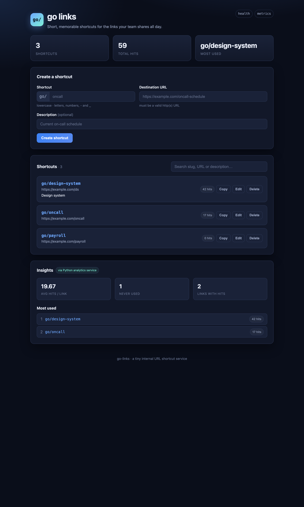

# go/ links

A small internal **URL shortcut service**. Create memorable shortcuts like
`go/oncall` or `go/payroll`, browse and search them, and get redirected to their
destination — with hit tracking, a clean web UI, and production-friendly
observability.

It's built as a focused first iteration: a well-organised foundation a team
could keep building on, rather than a feature-complete product.

> Part of the [go-links monorepo](../README.md) — this is the **TypeScript**
> service (it owns writes and the UI). A companion **Python** analytics service
> lives in [`../analytics`](../analytics/README.md); deployment for both is in
> [`../DEPLOY.md`](../DEPLOY.md).



---

## Contents

- [Overview](#overview)
- [Architecture](#architecture)
- [Tech stack & why](#tech-stack--why)
- [Data model](#data-model)
- [Getting started](#getting-started)
- [Configuration](#configuration)
- [API](#api)
- [Key flows explained](#key-flows-explained)
- [Observability](#observability)
- [Project structure](#project-structure)
- [Testing](#testing)
- [Production deployment (nginx + systemd)](#production-deployment-nginx--systemd)
- [Design decisions & tradeoffs](#design-decisions--tradeoffs)
- [Roadmap](#roadmap)
- [Notes](#notes)

---

## Overview

Internal "go links" are short, human-friendly redirects (`go/<slug>`) that map to
longer, forgettable URLs. This service lets anyone:

- **Create** a shortcut (`slug` → destination `url`, with an optional description).
- **Browse & search** all shortcuts.
- **Edit / delete** shortcuts.
- **Resolve** `go/<slug>` via an HTTP redirect, counting each hit.

It runs on an **in-memory store with zero setup** for local development, and on
**MongoDB** in production — the storage layer sits behind an interface, so the
two are fully interchangeable.

## Architecture

```
                 ┌──────────────────────────────────────────────┐
  Browser  ──▶   │  nginx (:80/:443)                             │
                 │   • serves the static UI  (public/)           │
                 │   • reverse-proxies /api, /go, /healthz,       │
                 │     /metrics  ──▶  Node app (127.0.0.1:3000)   │
                 └───────────────────────┬──────────────────────┘
                                         │
                            ┌────────────▼─────────────┐
                            │  Fastify app (TypeScript) │
                            │   routes → repository      │
                            └────────────┬─────────────┘
                                         │  LinkRepository interface
                            ┌────────────▼─────────────┐
                            │  MongoDB   (or in-memory) │
                            └───────────────────────────┘
```

- **One origin in production.** nginx serves the UI and proxies the API, so the
  browser talks to a single origin — no CORS, and the frontend uses relative
  paths (`/api/...`), which means the exact same UI works when served directly by
  the Node dev server too.
- **The app is transport-thin.** Route handlers validate input and delegate to a
  `LinkRepository`. All business rules (validation, uniqueness) live in one place.

## Tech stack & why

| Concern | Choice | Rationale |
| --- | --- | --- |
| HTTP framework | [Fastify](https://fastify.dev) 5 | Fast, first-class TypeScript, and **Pino logging + request IDs built in** — observability with almost no glue. |
| Database | [MongoDB](https://www.mongodb.com) 7 (driver v6+) | Document model fits a link record naturally; the slug becomes the `_id`, giving a unique key and index-backed lookups for free. |
| Validation | [Zod](https://zod.dev) | One schema is the single source of truth for validation **and** the inferred TypeScript types. |
| Metrics | [prom-client](https://github.com/siimon/prom-client) | Prometheus is the de-facto standard; exposes `/metrics` for scraping. |
| Language | TypeScript | Type safety across the domain, repository and routes. |
| Tests | [Vitest](https://vitest.dev) | Fast and ESM-native; Fastify's `inject()` gives real HTTP tests with no open sockets. |
| Frontend | Vanilla HTML/CSS/JS | No build step, so nginx serves it as plain static files. Kept intentionally dependency-free (see tradeoffs). |

## Data model

Each link is a single MongoDB document in the `links` collection:

```jsonc
{
  "_id": "oncall",                         // the slug — unique by construction
  "url": "https://example.com/oncall",
  "description": "Current on-call schedule", // optional
  "hits": 12,
  "createdAt": ISODate("..."),
  "updatedAt": ISODate("..."),
  "lastAccessedAt": ISODate("...")          // set on first resolve
}
```

**Indexes** (created automatically on startup):

- `_id` (implicit, unique) — enforces one document per slug and powers lookups/redirects.
- `hits: -1` — supports "most used" ordering / analytics.
- `createdAt: -1` — supports recency queries.

Over the API, dates are serialised to ISO strings and empty optional fields are
omitted.

## Getting started

**Prerequisites:** Node.js ≥ 20 and npm. MongoDB is optional for local dev.

```bash
npm install
```

> If `npm install` fails behind a private registry, install from the public one:
> `npm install --registry https://registry.npmjs.org/`.

### Option A — run with zero setup (in-memory)

Leave `MONGODB_URI` unset and the app uses an in-memory store seeded with a few
example links (data resets on restart):

```bash
npm run dev        # pretty logs + hot reload → http://localhost:3000
```

### Option B — run with MongoDB

Point `MONGODB_URI` at any MongoDB. The app **creates the database, collection
and indexes on startup** if they don't exist.

```bash
cp .env.example .env
# then edit .env, e.g. for MongoDB Atlas:
# MONGODB_URI=mongodb+srv://<user>:<password>@<cluster>.mongodb.net/?appName=<app>
npm run dev
```

Prefer a throwaway local database? With Docker:

```bash
docker run -d --name go-mongo -p 27017:27017 mongo:7
MONGODB_URI="mongodb://127.0.0.1:27017" npm run dev
```

### Scripts

| Script | Description |
| --- | --- |
| `npm run dev` | Run in watch mode with human-friendly logs (`tsx`). |
| `npm test` | Run the Vitest suite once. |
| `npm run typecheck` | Type-check without emitting. |
| `npm run build` | Compile TypeScript to `dist/`. |
| `npm start` | Run the compiled server (`node dist/server.js`). |

## Configuration

All environment variables are optional and have sane defaults (see `.env.example`):

| Variable | Default | Purpose |
| --- | --- | --- |
| `HOST` | `0.0.0.0` | Bind address. |
| `PORT` | `3000` | Port. |
| `LOG_LEVEL` | `info` | Pino level (`trace`…`fatal`, or `silent`). |
| `NODE_ENV` | `development` | `development` = pretty logs; anything else = JSON logs. |
| `MONGODB_URI` | *(unset)* | MongoDB connection string. **Unset → in-memory store.** |
| `MONGODB_DB` | `golinks` | Database name (created if missing). |
| `MONGODB_COLLECTION` | `links` | Collection name (created if missing). |
| `ANALYTICS_URL` | *(unset)* | If set, proxy `/analytics/*` to the Python analytics service (local-dev convenience; nginx handles this in production). |

## API

All responses are JSON with a `{ "data": ... }` envelope; errors use
`{ "error": { code, message, details?, requestId } }`.

| Method | Path | Description |
| --- | --- | --- |
| `GET` | `/api/links` | List links. Optional `?q=` filters slug/url/description. |
| `GET` | `/api/links/:slug` | Fetch a single link. |
| `POST` | `/api/links` | Create a link. Body: `{ slug, url, description? }`. |
| `PUT` | `/api/links/:slug` | Update `url` and/or `description`. |
| `DELETE` | `/api/links/:slug` | Delete a link. |
| `GET` | `/go/:slug` | **Redirect** (302) to the destination, counting the hit. A miss redirects to the UI with the slug prefilled. |
| `GET` | `/healthz` | Liveness/readiness probe. |
| `GET` | `/metrics` | Prometheus metrics. |

### Examples

```bash
# Create
curl -X POST localhost:3000/api/links \
  -H 'content-type: application/json' \
  -d '{"slug":"oncall","url":"https://example.com/oncall","description":"Current rota"}'

# Resolve (follow the redirect)
curl -iL localhost:3000/go/oncall

# Search
curl 'localhost:3000/api/links?q=onc'
```

Validation-failure response:

```json
{
  "error": {
    "code": "validation_error",
    "message": "Request validation failed",
    "details": [{ "path": "slug", "message": "slug must be lowercase and may contain letters, numbers, '-' and '_'" }],
    "requestId": "07a2e894-7093-4a62-803a-cfe790b11f75"
  }
}
```

**Validation rules:** slugs are lowercase `[a-z0-9_-]` (≤128 chars); URLs must be
valid `http(s)` — this blocks `javascript:`/`data:` destinations.

## Key flows explained

**Create.** UI form → `POST /api/links` → Zod validates the body → repository
inserts a document keyed by slug. A duplicate slug surfaces as a MongoDB
duplicate-key error, which the repository translates into a clean **409 Conflict**
rather than leaking a driver error.

**Resolve (`/go/:slug`).** The redirect handler atomically increments `hits` and
sets `lastAccessedAt` (`$inc`/`$set` in one round-trip), then issues a **302** to
the destination. A **miss is treated as a normal outcome, not an error**: the user
is redirected to the UI with `?missing=<slug>`, which prefills the create form —
turning a dead end into "create it now".

**Search.** The UI debounces input and calls `GET /api/links?q=`. The Mongo
repository builds a case-insensitive, regex-escaped `$or` across slug/url/
description; the in-memory store does the equivalent in JS. Same behaviour, same
tests, either backend.

**Edit / delete.** Inline in the UI, backed by `PUT`/`DELETE`. Updates only touch
the provided fields and always bump `updatedAt`.

## Observability

- **Structured logs** — Pino. Pretty in development, JSON everywhere else.
- **Request correlation** — every request gets an id (honouring an inbound
  `x-request-id` if present); it appears on every log line, in error bodies, and
  in the `x-request-id` response header. nginx's `$request_id` is forwarded, so a
  request can be traced edge-to-app.
- **Metrics** (`/metrics`):
  - `http_request_duration_seconds` histogram, labelled by method / **route
    pattern** / status (route pattern keeps cardinality bounded).
  - `golinks_redirects_total{result="hit"|"miss"}` counter.
  - `golinks_links_total` gauge.
  - Plus default Node/process metrics.
- **Health** — `GET /healthz` returns status + uptime, suitable for probes.

## Project structure

```
src/
  server.ts                     # entrypoint + composition root (chooses the store)
  app.ts                        # app assembly: logging, hooks, error handler, routes, static
  config.ts                     # env parsing with defaults
  domain/link.ts                # Zod schemas + Link type (validation source of truth)
  errors.ts                     # typed AppError hierarchy → HTTP status + code
  metrics.ts                    # Prometheus registry + metrics
  db/mongo.ts                   # connection + idempotent schema/index creation
  repository/
    link-repository.ts          # persistence interface (the swap point)
    in-memory-link-repository.ts# Map-backed implementation (dev/tests)
    mongo-link-repository.ts    # MongoDB implementation
  routes/
    links.ts                    # CRUD API
    redirect.ts                 # GET /go/:slug
    system.ts                   # /healthz + /metrics
public/                         # static UI served by nginx (index.html, styles.css, app.js)
test/                           # Vitest suites (API, redirect, system, Mongo integration)
```

## Testing

```bash
npm test
```

- **Hermetic by default.** API/redirect/system suites run against the in-memory
  store via Fastify `inject()` — no database or open ports required.
- **MongoDB integration test** runs only when a URI is provided, so it never
  breaks the default run:

```bash
docker run -d --name go-mongo -p 27017:27017 mongo:7
MONGODB_TEST_URI="mongodb://127.0.0.1:27017" npm test
```

## Production deployment (nginx + systemd)

This service binds to `127.0.0.1:3000` so it's only reachable through nginx, which
serves the static UI and reverse-proxies `/api`, `/go`, `/healthz` and `/metrics`
to it. In production it runs under systemd alongside the Python analytics service.

The full, copy-paste VM runbook — provisioning, pinned versions, a reserved static
IP, MongoDB Atlas, nginx routing for **both** services, TLS and operations — is at
[`../DEPLOY.md`](../DEPLOY.md).

## Design decisions & tradeoffs

- **In-memory default, MongoDB in production.** Zero-setup local runs and a clean
  hermetic test suite, without giving up a real database. The `LinkRepository`
  interface makes them interchangeable — the API layer never knows which is in use.
- **Slug as `_id`.** Uniqueness and fast lookups for free, no secondary unique
  index needed. Tradeoff: renaming a slug means insert+delete rather than an
  in-place update — acceptable, since slugs are the identity of a link.
- **Flat slug namespace** (`go/oncall`, not `go/team/oncall`) for v1 — simpler
  routing and validation; hierarchical slugs are a natural follow-up.
- **Vanilla-JS frontend.** No build tooling, so nginx serves plain files and the
  repo stays approachable. A larger app would move to a typed component framework;
  here it wasn't worth the added complexity.
- **Regex search, not a text index.** Fine and predictable at small scale; a
  `$text` index or Atlas Search would be the move as data grows.
- **302 (temporary) redirects.** Keeps destinations editable without browsers
  caching an old target, and lets every visit be counted.
- **No authentication.** Typical go-link deployments sit behind SSO/an internal
  network; auth was deliberately left out of this iteration.

## Roadmap

- **Auth & ownership**: who created a link, edit permissions, SSO integration.
- **Concurrency safety**: optimistic `updatedAt` checks on edit.
- **Hierarchical slugs** and optional `?arg` passthrough.
- **Richer analytics**: per-link time series from the `hits`/`lastAccessedAt` data.
- **Tracing**: OpenTelemetry spans to complement metrics, plus a Grafana dashboard.
- **Frontend**: typed component framework, inline field-level validation, optimistic UI.

## Notes

Built as a focused first iteration over a few hours. Where it stops short
(durable auth, hierarchical slugs, a heavier frontend) those were conscious
scoping decisions — see **Tradeoffs** and **Roadmap** above.

## License

MIT.
